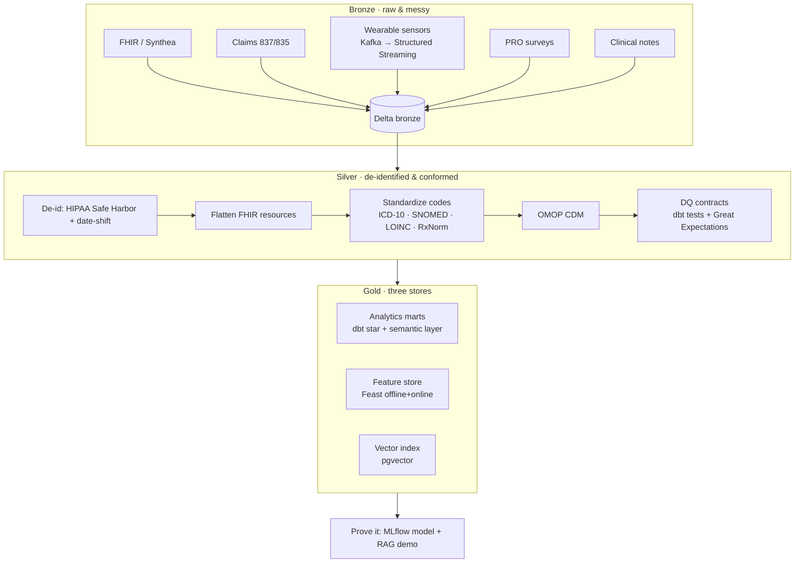

# Architecture

Vitals follows a **medallion** lifecycle (bronze → silver → gold) with a healthcare layer overlaid —
the part a generic ETL project doesn't have.

## Why three gold stores

Analytics, classical ML, and LLM/RAG need different shapes of the same clean data:

- **Analytics marts** — dimensional `fct_`/`dim_` models plus a semantic layer with governed metric
  definitions. The trusted serving layer for BI and cohort analysis.
- **Feature store (Feast)** — entity = patient; time-windowed aggregates (`resting_hr_p50_7d`,
  `adherence_rate_30d`, `days_since_last_encounter`). Offline for training, online for real-time scoring.
- **Vector index (pgvector)** — embeddings of clinical notes / messages for semantic search and RAG.

## The healthcare layer

- **De-identification at silver.** PHI is tagged and access-gated at bronze; silver is the
  de-identified boundary (HIPAA Safe Harbor — drop the 18 identifier types — plus per-patient
  date-shifting to preserve temporal order). Everything downstream reads only de-identified data.
- **Standardized vocabularies.** ICD-10 (diagnoses), SNOMED CT (problems), LOINC (labs/observations),
  RxNorm (medications) — mapped on the way into a recognizable **OMOP Common Data Model**.
- **Data-quality contracts.** Validity, completeness (the silent-bias killer in health), unit
  consistency, uniqueness, and timeliness — enforced as contracts at the silver gate.

## Tooling

| Stage | Tool |
|---|---|
| Orchestration | Airflow |
| Bronze ingest | PySpark; Spark Structured Streaming (sensors via Kafka) |
| Storage | Delta on Databricks (ACID, schema evolution, time travel) |
| Silver→Gold | dbt (`staging/` → `intermediate/` → `marts/`) |
| Data quality | dbt tests + Great Expectations |
| Feature store | Feast |
| Vector DB | pgvector |
| Serving / monitoring | MLflow + drift detection |
| IaC | Terraform |
