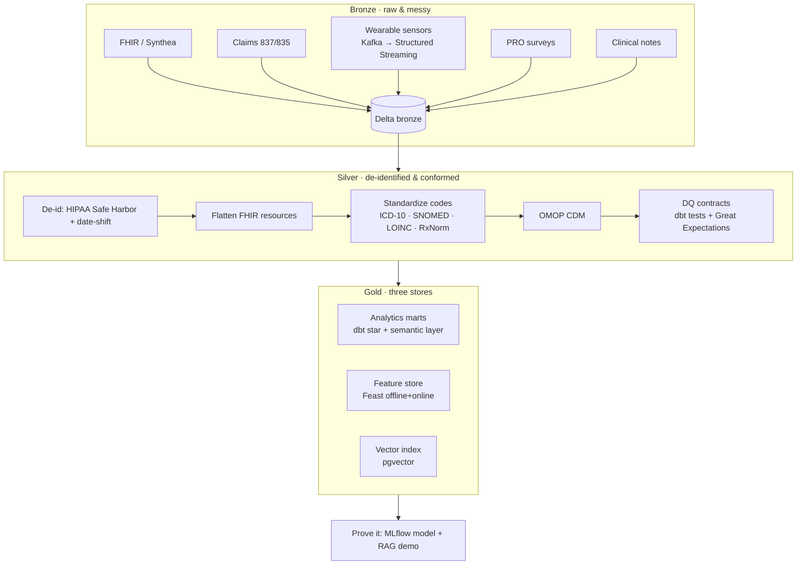

# Architecture

Vitals follows a **medallion** lifecycle (bronze → silver → gold) with a healthcare layer overlaid —
the part a generic ETL project doesn't have.

## Why three gold stores

Analytics, classical ML, and LLM/RAG need different shapes of the same clean data:

- **Analytics marts** — dimensional `fct_`/`dim_` models plus a **MetricFlow semantic layer**
  (declarative, composable metrics: surgery rate, conservative spend, adherence — one definition
  shared by BI, cohort analysis, and ad-hoc queries). The trusted serving layer for downstream
  consumers. Local DuckDB; dialect-fixed and validated live on the Databricks serverless job.
- **Feature store (Feast)** — entity = patient; 20 time-windowed aggregates spanning four source
  types (observations, claims, PRO surveys, wearables). **Online store** (sqlite) for low-latency
  inference; **offline store** (file) for point-in-time historical training joins (leakage-safe).
  Both paths materialized and parity-checked: `online_parity.all_match = true`,
  `historical_parity.all_match = true`.
- **Vector index (pgvector)** — 390 clinical notes indexed with **fastembed bge-small-en-v1.5**
  (384-d, HNSW cosine) in a local Docker pgvector instance. **TF-IDF** is the clone-and-run
  fallback when Docker is down. Retrieval-only; the demo proves the data is AI-ready, not an LLM
  project.

## The healthcare layer

- **De-identification at silver.** PHI is tagged and access-gated at bronze; silver is the
  de-identified boundary (HIPAA Safe Harbor — drop the 18 identifier types — plus per-patient
  date-shifting to preserve temporal order). Everything downstream reads only de-identified data.
- **Standardized vocabularies.** ICD-10 (diagnoses), SNOMED CT (problems), LOINC (labs/observations),
  RxNorm (medications) — mapped on the way into a recognizable **OMOP Common Data Model**.
- **Data-quality contracts.** Validity, completeness (the silent-bias killer in health), unit
  consistency, uniqueness, and timeliness — enforced as contracts at the silver gate. **Great
  Expectations** (GX Core 1.x) validates coded-vocabulary value-sets — every `icd10_code` ∈ the
  allowed ICD-10 set, LOINC observation metrics, RxNorm-standardized units — in a suite of 14
  expectations; all 14 pass (`make dq`). This gate **runs in CI** and exits non-zero on any
  violation; it cannot be skipped.

## Production deployment

The medallion runs **two ways by design**:

- **Clone-and-run (DuckDB, default).** `make setup && make run` — no creds, no network, no Spark
  cluster. The local DuckDB target is the reproducible baseline any reviewer can run.
- **Databricks serverless job (production).** A Databricks Asset Bundle (`databricks.yml`) ships
  the full pipeline as a **scheduled serverless job**: `medallion_ingest` (Python wheel — generate
  → bronze Delta → silver Delta with PHI + non-empty gates) → `gold_dbt` (dbt marts + tests) →
  `drift_monitor` (PSI feature-drift scored to `vitals_gold.monitoring.drift_report`). Verified
  `TERMINATED SUCCESS`; bronze = 28,816 rows, silver = 27,402. Failure alerts page on every failed
  run.

The **wearable stream** reads from a **real local Kafka broker** (Docker, single-node KRaft), not
just a file source. Parity is proven: `make stream-parity` runs both the file and Kafka paths
through the shared `clean_wearables` transform and asserts identical cleaned output (15,169 events,
file == kafka).

## Tooling

| Stage | Tool |
|---|---|
| Orchestration | Airflow |
| Bronze ingest | PySpark; Spark Structured Streaming (sensors via Kafka) |
| Storage | Delta on Databricks (ACID, schema evolution, time travel) |
| Silver→Gold | dbt (`staging/` → `intermediate/` → `marts/`) |
| Data quality | dbt tests + Great Expectations |
| Feature store | Feast |
| Vector DB | pgvector |
| Serving / monitoring | MLflow + drift detection |
| Production deploy | Databricks Asset Bundle (`databricks.yml`); scheduled serverless job |
| IaC | Terraform |
