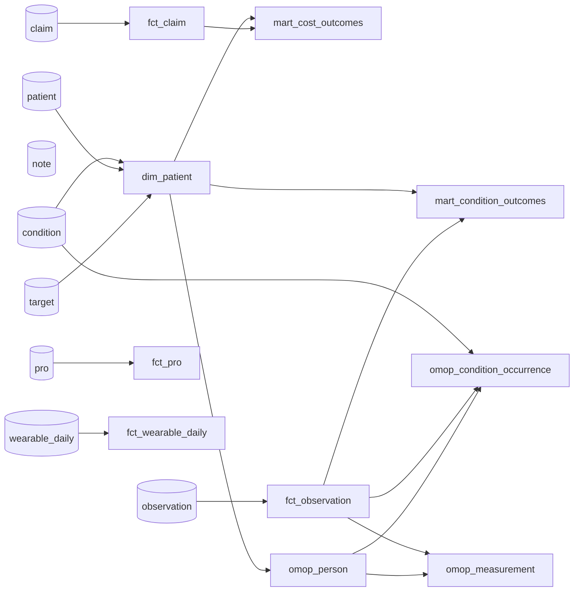

# Data Catalog & Lineage

Auto-generated from dbt's `manifest.json` + `catalog.json` (`python -m vitals.catalog`). Regenerated whenever the models change.

## Lineage

## Tables

### `dim_patient`

Conformed patient dimension (de-identified) with primary condition + target.

| Column | Type | Description |
|---|---|---|
| patient_key | VARCHAR |  |
| surgery_90d | INTEGER |  |
| gender | VARCHAR |  |
| age | INTEGER |  |
| primary_condition_code | VARCHAR |  |
| primary_condition | VARCHAR |  |

### `fct_claim`

Conservative-care claim fact (leakage-free).

| Column | Type | Description |
|---|---|---|
| patient_key | VARCHAR |  |
| claim_date | DATE |  |
| procedure_code | VARCHAR |  |
| procedure_display | VARCHAR |  |
| dx_code | VARCHAR |  |
| billed | DOUBLE |  |
| paid | DOUBLE |  |
| denied | BOOLEAN |  |

### `fct_observation`

Standardized observation fact.

| Column | Type | Description |
|---|---|---|
| patient_key | VARCHAR |  |
| metric | VARCHAR |  |
| unit_std | VARCHAR |  |
| obs_date | DATE |  |
| loinc_code | VARCHAR |  |
| value_std | DOUBLE |  |

### `fct_pro`

Oswestry Disability Index over time.

| Column | Type | Description |
|---|---|---|
| score | BIGINT |  |
| patient_key | VARCHAR |  |
| survey_date | DATE |  |
| instrument | VARCHAR |  |

### `fct_wearable_daily`

Cleaned wearable daily series.

| Column | Type | Description |
|---|---|---|
| patient_key | VARCHAR |  |
| day | DATE |  |
| steps | BIGINT |  |
| active_minutes | BIGINT |  |
| resting_hr | BIGINT |  |
| sleep_hours | DOUBLE |  |

### `mart_condition_outcomes`

Per-condition analytics mart with surgery-rate / pain / adherence metrics.

| Column | Type | Description |
|---|---|---|
| primary_condition | VARCHAR |  |
| primary_condition_code | VARCHAR |  |
| n_patients | BIGINT |  |
| surgery_rate | DOUBLE |  |
| avg_pain | DOUBLE |  |
| avg_adherence_pct | DOUBLE |  |

### `mart_cost_outcomes`

Per-condition conservative-care spend, imaging rate, surgery rate.

| Column | Type | Description |
|---|---|---|
| primary_condition | VARCHAR |  |
| n_patients | BIGINT |  |
| surgery_rate | DOUBLE |  |
| avg_conservative_spend | DOUBLE |  |
| imaging_rate | DOUBLE |  |
| claim_denial_rate | DOUBLE |  |

### `omop_condition_occurrence`

OMOP CDM CONDITION_OCCURRENCE — ICD-10 mapped to standard concepts.

| Column | Type | Description |
|---|---|---|
| condition_occurrence_id | BIGINT |  |
| person_id | BIGINT |  |
| condition_concept_id | INTEGER |  |
| condition_source_value | VARCHAR |  |
| condition_concept_name | VARCHAR |  |
| condition_start_date | DATE |  |

### `omop_measurement`

OMOP CDM MEASUREMENT — LOINC observations mapped to standard concepts.

| Column | Type | Description |
|---|---|---|
| measurement_id | BIGINT |  |
| measurement_concept_id | INTEGER |  |
| person_id | BIGINT |  |
| measurement_concept_name | VARCHAR |  |
| measurement_source_value | VARCHAR |  |
| value_as_number | DOUBLE |  |
| unit_source_value | VARCHAR |  |
| measurement_date | DATE |  |

### `omop_person`

OMOP CDM PERSON — de-identified, standard gender concepts.

| Column | Type | Description |
|---|---|---|
| person_id | BIGINT |  |
| gender_concept_id | INTEGER |  |
| patient_key | VARCHAR |  |
| year_of_birth | INTEGER |  |
